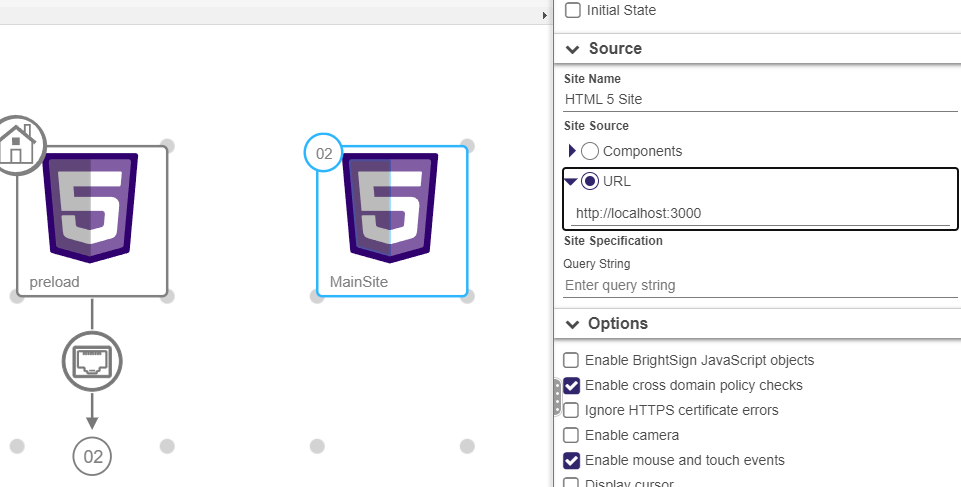

## Overview

This Express server runs on port 3000 and provides two routes: the first is a "preload" route which looks for an "Archive.zip" file in the "pool1" folder, and extracts its contents to the "www" folder of the SD card. The second route is a default route of "/", which serves up the result of that extract.

## Install

'npm install' to install packages required. When complete, 'npx webpack' to create the server-bundle.js in the 'dist' folder.

Load the 'server-bundle.js' as a Support Content -> Node.js in BrightAuthor:connected.

Your website needs to be zipped into a file called "Archive.zip". This "Archive.zip" needs to be loaded as a Support Content -> File in BrightAuthor:connected. Create an HTML Widget that points to http://localhost:3000/preload. Add an Event Handler UDP that listes for "loadSite". Create a second HTML Widget that points to the actual site at http://localhost:3000.

When you want to load a new site, start with the "preload" HTML Widget. If you just want to load the site and not make any updates, load the normal HTML Widget at http://localhost:3000

